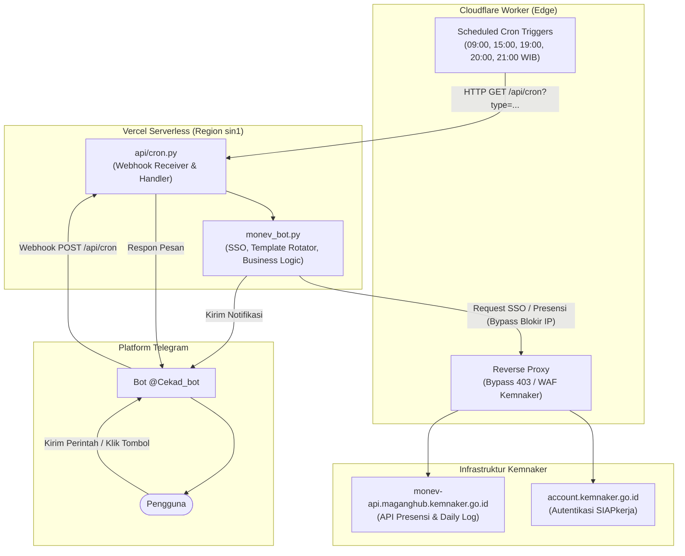

# Monev ADE7 Reminder - MagangHub Kemnaker

[](https://www.python.org/)
[](https://vercel.com)
[](https://t.me/Cekad_bot)
[](LICENSE)
[-success.svg)](#arsitektur-sistem)

Sistem otomatisasi pemantauan kehadiran, notifikasi pengingat, dan pencatatan presensi serta logbook cadangan untuk portal MagangHub Kemnaker (SIAPkerja). Dibangun dengan arsitektur hibrida berbasis Cloudflare Workers (penjadwalan cron dan reverse proxy) dan Vercel Serverless (backend Python 3.11) yang terintegrasi dengan bot Telegram 24/7.

---

## Daftar Isi

- [Arsitektur Sistem](#arsitektur-sistem)
- [Jadwal Otomatisasi (Cron Job)](#jadwal-otomatisasi-cron-job)
- [Fitur Utama](#fitur-utama)
- [Daftar Perintah Telegram Bot](#daftar-perintah-telegram-bot)
- [Struktur Proyek](#struktur-proyek)
- [Variabel Lingkungan (Environment Variables)](#variabel-lingkungan-environment-variables)
- [Panduan Instalasi dan Deployment](#panduan-instalasi-dan-deployment)
  - [1. Konfigurasi Backend di Vercel](#1-konfigurasi-backend-di-vercel)
  - [2. Konfigurasi Cloudflare Worker](#2-konfigurasi-cloudflare-worker)
  - [3. Setup Webhook Telegram](#3-setup-webhook-telegram)
  - [4. Pengujian di Lingkungan Lokal](#4-pengujian-di-lingkungan-lokal)
- [Mekanisme Anti-Deteksi dan Keamanan](#mekanisme-anti-deteksi-dan-keamanan)
- [Pertanyaan Umum dan Pemecahan Masalah](#pertanyaan-umum-dan-pemecahan-masalah)
- [Lisensi](#lisensi)

---

## Arsitektur Sistem

Sistem memisahkan tanggung jawab operasional menjadi tiga komponen utama: penjadwalan waktu, jembatan jaringan, dan backend pemrosesan data.



### Integrasi Cloudflare Worker dan Vercel

1. **Cloudflare Worker**:
   - Berfungsi sebagai pemicu waktu (cron scheduler) yang mengeksekusi request secara tepat waktu tanpa antrean proses.
   - Berfungsi sebagai Reverse Proxy untuk meneruskan request ke server Kemnaker guna mencegah pemblokiran alamat IP pusat data Vercel (HTTP 403 Forbidden).
2. **Vercel Serverless**:
   - Menjalankan lingkungan Python 3.11 untuk memproses autentikasi SSO, verifikasi presensi, rotasi template kegiatan, dan penerima webhook pesan dari Telegram.

---

## Jadwal Otomatisasi (Cron Job)

Seluruh waktu operasional disinkronkan dengan zona Waktu Indonesia Barat (WIB, UTC+7):

| Waktu (WIB) | Cron (UTC) | Tipe Eksekusi | Deskripsi Operasional |
| :---: | :---: | :---: | :--- |
| **09:00 WIB** | `0 2 * * *` | `status (pagi)` | Pemeriksaan koneksi SSO Kemnaker dan laporan status presensi pagi. |
| **15:00 WIB** | `0 8 * * *` | `status (sore)` | Monitoring status kehadiran harian dan status persetujuan mentor lapangan. |
| **19:00 WIB** | `0 12 * * *` | `reminder (santai)` | Notifikasi pengingat pengisian presensi secara mandiri. Otomatis diabaikan jika presensi telah tercatat. |
| **20:00 WIB** | `0 13 * * *` | `reminder (keras)` | Peringatan batas akhir satu jam sebelum penutupan pengisian mandiri. |
| **21:00 WIB** | `0 14 * * *` | `auto` | Eksekusi cadangan otomatis untuk mengisi presensi dan logbook harian apabila presensi belum dilakukan secara mandiri. |

---

## Fitur Utama

- **Zero External Dependencies**: Menggunakan pustaka standar Python bawaan (`urllib`, `http.cookiejar`, `json`, `os`, `time`, `random`) tanpa memerlukan instalasi modul pihak ketiga.
- **Autentikasi SSO Otomatis & Caching Token**: Mendukung siklus login SSO SIAPkerja multi-langkah (validasi cookie, token CSRF, dan callback handshake) disertai penyimpanan cache token lokal dengan batas waktu aktif (TTL) hingga 5.5 jam.
- **Validasi Kehadiran Mandiri (Guard Check)**: Sistem selalu memverifikasi status presensi di server Kemnaker terlebih dahulu. Apabila data kehadiran hari bersangkutan sudah berstatus `PRESENT`, sistem tidak akan melakukan penimpaan data.
- **Koleksi Template Kegiatan Non-Duplikasi**: Dilengkapi 35 variasi template logbook aktivitas harian. Setiap template yang telah digunakan dicatat ke dalam `used_templates.json` sehingga tidak terjadi pengulangan kegiatan.
- **Simulasi Deviasi Koordinat (GPS Jittering)**: Koordinat presensi diberi deviasi mikro natural secara acak (rentang 10 hingga 25 meter) agar posisi presensi tidak terdeteksi sebagai koordinat statis.
- **Mekanisme Debounce (15 Menit)**: Mencegah eksekusi ganda apabila terjadi pemicuan berulang dalam interval waktu yang berdekatan.
- **Dukungan Akhir Pekan (Weekend Awareness)**: Pengingat otomatis memberikan label penyesuaian khusus pada hari libur (Sabtu dan Minggu).
- **Antarmuka Bot Interaktif**: Dilengkapi menu tombol inline pada Telegram untuk mempermudah pengecekan status dan konfirmasi tindakan.

---

## Daftar Perintah Telegram Bot

Berikut daftar perintah yang didukung oleh bot Telegram `@Cekad_bot`:

| Perintah | Fungsi |
| :--- | :--- |
| `/start`, `/help` | Menampilkan ringkasan sistem, bantuan, dan menu tombol utama. |
| `/cek`, `/status` | Memeriksa status presensi hari ini tanpa mengubah data. |
| `/tes` | Menjalankan uji diagnostik koneksi SSO Kemnaker dan status proxy. |
| `/sisa`, `/template` | Menampilkan informasi total template, template terpakai, dan sisa template. |
| `/rekap` | Menampilkan rekapitulasi kehadiran 7 hari terakhir beserta status persetujuan mentor. |
| `/isi <kegiatan>` | Mengisi presensi hari ini menggunakan teks kegiatan khusus dari obrolan. |
| `/monev` | Menjalankan pengisian presensi hari ini dengan dialog konfirmasi terlebih dahulu. |
| `/proxy` | Menampilkan status dan endpoint Cloudflare Reverse Proxy yang sedang aktif. |

---

## Struktur Proyek

```text
monev/
├── api/
│   └── cron.py                 # Endpoint serverless Vercel (Webhook & Cron Handler)
├── .github/
│   └── workflows/
│       └── monev_cron.yml      # Workflow cadangan (GitHub Actions)
├── cloudflare_worker.js        # Script Cloudflare Worker (Cron Trigger & Reverse Proxy)
├── monev_bot.py                # Mesin utama: SSO Kemnaker, API client, template engine
├── telegram_polling.py         # Skrip pengujian interaksi bot lokal via polling
├── templates.json              # Koleksi 35 template aktivitas, pembelajaran, dan kendala
├── reminder_templates.json     # Variasi teks notifikasi pengingat harian
├── used_templates.json         # Log riwayat template kegiatan yang telah digunakan
├── wrangler.toml               # Konfigurasi deployment Cloudflare Worker
├── vercel.json                 # Konfigurasi deployment runtime Vercel
├── requirements.txt            # Daftar dependensi Python
└── README.md                   # Dokumentasi teknis proyek
```

---

## Variabel Lingkungan (Environment Variables)

Variabel-variabel berikut harus dikonfigurasikan pada file `.env` untuk penggunaan lokal atau pada menu **Environment Variables** di dasbor Vercel:

| Nama Variabel | Status | Deskripsi |
| :--- | :---: | :--- |
| `KEMNAKER_USERNAME` | Wajib | Nomor Identitas Kependudukan (NIK) akun SIAPkerja Kemnaker. |
| `KEMNAKER_PASSWORD` | Wajib | Kata sandi akun SIAPkerja Kemnaker. |
| `OFFICE_LAT` | Wajib | Titik koordinat Latitude lokasi magang (contoh: `-7.8981812`). |
| `OFFICE_LONG` | Wajib | Titik koordinat Longitude lokasi magang (contoh: `110.0499084`). |
| `TELEGRAM_BOT_TOKEN` | Wajib | Token otorisasi bot yang diperoleh dari `@BotFather`. |
| `TELEGRAM_CHAT_ID` | Wajib | ID akun Telegram pengguna penerima laporan. |
| `CLOUDFLARE_WORKER_URL`| Wajib | URL publik Cloudflare Worker (contoh: `https://monev-proxy.user.workers.dev`). |
| `CRON_SECRET` | Opsional | Kunci autentikasi tambahan untuk membatasi eksekusi endpoint cron. |

---

## Panduan Instalasi dan Deployment

### 1. Konfigurasi Backend di Vercel

1. Hubungkan repositori ini ke proyek baru pada [Vercel](https://vercel.com).
2. Masuk ke menu **Settings** > **Environment Variables**, lalu daftarkan seluruh variabel lingkungan yang diperlukan sesuai tabel di atas.
3. Jalankan proses deployment. Vercel akan membaca konfigurasi `vercel.json` dan mempublikasikan endpoint `api/cron.py`.

### 2. Konfigurasi Cloudflare Worker

1. Masuk ke [Cloudflare Dashboard](https://dash.cloudflare.com) > **Workers & Pages** > **Create Worker**.
2. Beri nama worker (misalnya `monev-proxy`), lalu klik **Deploy**.
3. Buka menu **Quick Edit**, masukkan seluruh kode dari berkas `cloudflare_worker.js`, kemudian simpan dan terapkan.
4. Pada tab **Settings** > **Triggers**, tambahkan ekspresi cron berikut:
   - `0 2 * * *` (09:00 WIB)
   - `0 8 * * *` (15:00 WIB)
   - `0 12 * * *` (19:00 WIB)
   - `0 13 * * *` (20:00 WIB)
   - `0 14 * * *` (21:00 WIB)
5. Pada tab **Settings** > **Variables**, konfigurasikan variabel:
   - `VERCEL_DOMAIN` = URL deployment Vercel Anda (contoh: `https://monev-wine.vercel.app`)
   - `CRON_SECRET` = Kunci rahasia cron (jika menggunakan pengaman)
6. Salin domain worker yang diperoleh dan masukkan ke variabel `CLOUDFLARE_WORKER_URL` pada Vercel.

*(Alternatif: Gunakan Wrangler CLI dengan perintah `npx wrangler deploy`)*.

### 3. Setup Webhook Telegram

Untuk menghubungkan bot Telegram dengan serverless endpoint di Vercel, buka peramban dan akses URL berikut:

```text
https://monev-wine.vercel.app/api/cron?setup=1
```

Sistem akan memberikan respon konfirmasi bahwa webhook telah terdaftar secara aktif.

### 4. Pengujian di Lingkungan Lokal

Untuk menjalankan pengujian diagnostik secara lokal:

```bash
# 1. Menjalankan pengujian koneksi SSO dan profil peserta
python -c "import monev_bot; print(monev_bot.test_koneksi_sistem())"

# 2. Menjalankan verifikasi status kehadiran hari ini
python -c "import monev_bot; print(monev_bot.format_status_presensi())"

# 3. Menjalankan bot Telegram lokal via polling
python telegram_polling.py --force
```

---

## Mekanisme Anti-Deteksi dan Keamanan

1. **Variasi Koordinat Acak (GPS Jitter)**:
   Perhitungan koordinat menggunakan penambahan nilai acak kontinu dalam batas radius wajar:
   $$\text{Latitude}_{\text{baru}} = \text{Latitude}_{\text{asli}} \pm \text{Random}(-0.00015, 0.00015)$$
   $$\text{Longitude}_{\text{baru}} = \text{Longitude}_{\text{asli}} \pm \text{Random}(-0.00015, 0.00015)$$
2. **Rotasi Logbook Harian**:
   Deskripsi tugas, pembelajaran, dan kendala dipilih secara rotasional dari 35 basis data template teknis, memastikan tidak ada kesamaan teks pada dua hari yang berurutan.
3. **Penyimpanan Cache Token SSO**:
   Token akses disimpan sementara dalam direktori cache lokal untuk mengurangi frekuensi pengiriman request login berulang yang berpotensi memicu batasan kuota request (*rate limiting*).
4. **Validasi Hak Akses Telegram**:
   Setiap permintaan interaksi Telegram memvalidasi kesesuaian parameter `chat_id`. Permintaan dari pengguna yang tidak terdaftar akan langsung diabaikan.

---

## Pertanyaan Umum dan Pemecahan Masalah

**1. Mengapa presensi otomatis tidak langsung terisi pada pukul 09:00 WIB?**  
Pukul 09:00 WIB dan 15:00 WIB merupakan jadwal monitoring dan pelaporan status. Eksekusi pengisian presensi otomatis cadangan dijadwalkan pada pukul 21:00 WIB sebagai batas pengaman terakhir jika presensi belum diisi secara mandiri.

**2. Bagaimana prosedur menambahkan template kegiatan baru?**  
Buka berkas `templates.json` dan tambahkan data dengan struktur berikut:
```json
{
  "id": 36,
  "category": "it_support",
  "activity": "Deskripsi kegiatan teknis yang dilakukan.",
  "learning": "Pembelajaran teknis yang diperoleh.",
  "obstacles": "Kendala teknis yang dihadapi atau penanganan kendala."
}
```

**3. Apa yang terjadi jika server Kemnaker mengalami gangguan koneksi?**  
Sistem proxy Cloudflare Worker menerapkan mekanisme pengulangan otomatis (retry) sebanyak 2 kali dengan jeda waktu 3 detik dan batas waktu tunggu 55 detik. Apabila koneksi tetap gagal, sistem akan mengirimkan notifikasi rincian kendala ke Telegram.

---

## Lisensi

Proyek ini didistribusikan di bawah lisensi [MIT](LICENSE).
